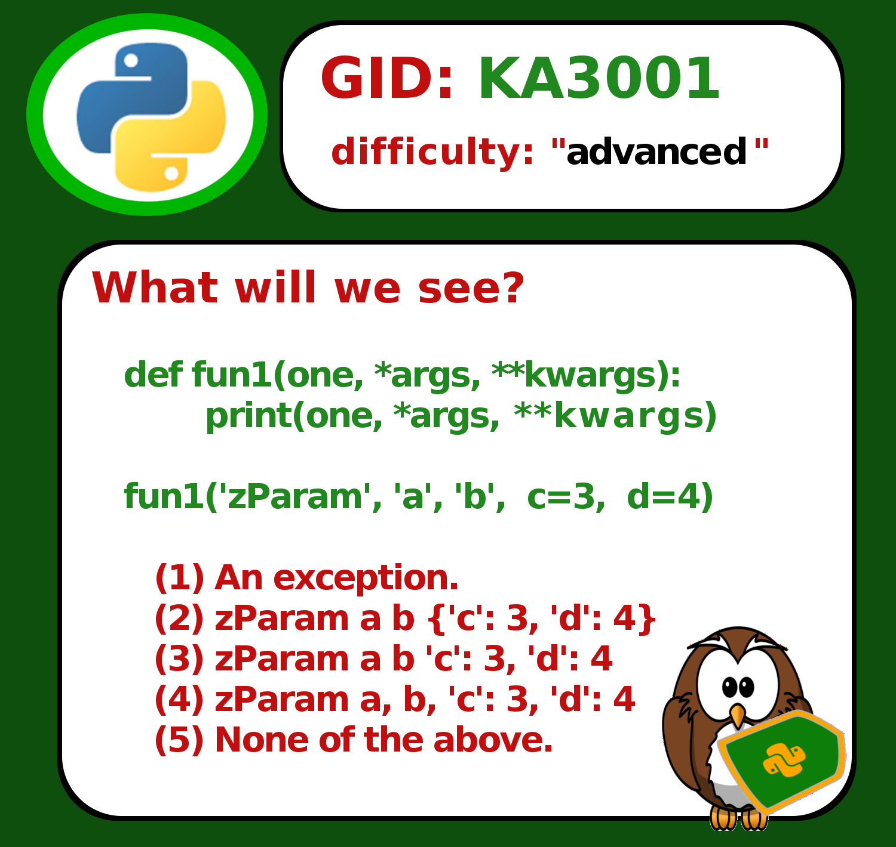

# JSOB Questions & Answers

The mission is to use a J.S.O.N friendly editor (like Notepad++ - recommended!) to manage / spell check a collection of questions.

Getting started: https://youtu.be/qBsSf2DIFLs

The sub-mission of the project is to ALSO uniquely identify - as well as to encode - each and every Quest()ion to better support planetary information sharing.

- We are also sharing the work-in-progress. An set of K-Questions, Answers, & Code that 'Pythoneers can use to better prepare for professional exams & interviews [in this folder](https://github.com/Python3-Training/PyQuest/tree/master/QuestJSOB/KASeries/KA9000)

- 2020/11/21: The [first book](https://www.amazon.com/dp/B08NYZ99PS) is designed for advanced Pythoneers. Kindle & paperback book is now on Amazon.
- 2020/11/26: The [second book](https://www.amazon.com/dp/B08P7JYG1R) is designed for 'functional' Pythoneers. Kindle & paperback book is also now on Amazon.

To get started collecting and / or managing your, mine, or our gobally-unique questions, simply run the GUI (below) and create a **[New]** project.

# GUI File Manager
The Quest()ion importation / exportation / sharing strategy is MainGUI.py.

## Key operations include:

**[New]** – Create a new .json file, with a default entry to clone / update.

**[Source]** – Load a previously created .json file.

**[Reload]** – Reload + renumber (Quest.ID, only) a .json file. **GENERATES a GID for any 'tbd' GIDs.**  Note that duplicate GIDs are accepted, as well as processed. 

**[Report]** – Tag, tally, and show counts for categories, classifications, and grand totals.

**[About]** – Display project name, and version.

**[Encode]** – Show what an encoded, selected entry, would look like.

**[Decode]** – Reverse the **[Encode]**

**[Paste]** – Read clipboard content into the main viewer (‘staging area’.) Usually followed by a **[Keep]**.

**[Copy]** – **[Encode]** and save a selected item to the clipboard – usually for sharing.

**[Keep]** – Save the entry into the active .json file.

**Note that each question is granted a unique global identifier (GID.)** The '**[Keep]**' operation requires that any 'kept' (imported) GID be unique. 

To add a duplicate entry to your .json collection, either (1) add the duplicate entry using your JSON editor, or (2) **[Keep]** the duplicate in a **[New]** JSOB collection.

p.s: When we need **[Reload]** to generate a NEW GID for any question(s), we may simply set a question's **GID: 'tbd',** using our JSON editor.

Status: Testing Release
Version: 1.x

How to use this code to collect, and reliably share, questions & answers: https://www.youtube.com/watch?v=qBsSf2DIFLs

Original mission: https://www.youtube.com/watch?v=HIDW7Q2r24g

## Something to collect:

BEGIN_BLOCK$
0y123|0y39|0y73|0y68|0y39|0y58|0y32|0y49|0y55|0y57|0y44|0y32|0y39|0y75|0y73$0y68|0y39|0y58|0y32|0y39|0y116|0y98|0y100|0y39|0y44|0y32|0y39|0y71|0y73|0y68$0y39|0y58|0y32|0y39|0y75|0y65|0y51|0y48|0y48|0y49|0y39|0y44|0y32|0y39|0y100$0y105|0y102|0y102|0y105|0y99|0y117|0y108|0y116|0y121|0y39|0y58|0y32|0y39|0y97|0y100$0y118|0y97|0y110|0y99|0y101|0y100|0y39|0y44|0y32|0y39|0y97|0y115|0y115|0y111|0y99$0y105|0y97|0y116|0y105|0y111|0y110|0y39|0y58|0y32|0y39|0y95|0y102|0y117|0y110|0y99$0y116|0y105|0y111|0y110|0y115|0y124|0y95|0y112|0y97|0y114|0y97|0y109|0y101|0y116|0y101$0y114|0y115|0y124|0y95|0y111|0y112|0y101|0y114|0y97|0y116|0y111|0y114|0y115|0y124|0y95$0y110|0y116|0y115|0y39|0y44|0y32|0y39|0y115|0y116|0y97|0y116|0y117|0y115|0y39|0y58$0y32|0y39|0y103|0y116|0y103|0y39|0y44|0y32|0y39|0y113|0y117|0y101|0y115|0y116|0y105$0y111|0y110|0y39|0y58|0y32|0y34|0y87|0y104|0y97|0y116|0y32|0y119|0y105|0y108|0y108$0y32|0y119|0y101|0y32|0y115|0y101|0y101|0y63|0y92|0y92|0y611|0y615|0y92|0y92|0y611$0y615|0y100|0y101|0y102|0y32|0y102|0y117|0y110|0y49|0y40|0y111|0y110|0y101|0y44|0y32$0y42|0y97|0y114|0y103|0y115|0y44|0y32|0y42|0y42|0y107|0y119|0y97|0y114|0y103|0y115$0y41|0y58|0y92|0y92|0y611|0y32|0y32|0y32|0y32|0y32|0y32|0y32|0y32|0y112|0y114$0y105|0y110|0y116|0y40|0y111|0y110|0y101|0y44|0y32|0y42|0y97|0y114|0y103|0y115|0y44$0y32|0y42|0y42|0y107|0y119|0y97|0y114|0y103|0y115|0y39|0y41|0y92|0y92|0y611|0y615$0y92|0y92|0y611|0y615|0y102|0y117|0y110|0y49|0y40|0y39|0y122|0y80|0y97|0y114|0y97$0y109|0y39|0y44|0y32|0y39|0y97|0y39|0y44|0y39|0y98|0y39|0y44|0y32|0y99|0y61$0y51|0y44|0y32|0y100|0y61|0y52|0y41|0y34|0y44|0y32|0y39|0y97|0y110|0y115|0y119$0y101|0y114|0y39|0y58|0y32|0y34|0y92|0y92|0y611|0y615|0y91|0y49|0y93|0y32|0y65$0y110|0y32|0y101|0y114|0y114|0y111|0y114|0y46|0y32|0y92|0y92|0y611|0y615|0y40|0y50$0y41|0y32|0y122|0y80|0y97|0y114|0y97|0y109|0y32|0y97|0y32|0y98|0y32|0y123|0y39$0y99|0y39|0y58|0y32|0y51|0y44|0y32|0y39|0y100|0y39|0y58|0y32|0y52|0y125|0y32$0y92|0y92|0y611|0y615|0y40|0y51|0y41|0y32|0y122|0y80|0y97|0y114|0y97|0y109|0y32$0y97|0y32|0y98|0y32|0y39|0y99|0y39|0y58|0y32|0y51|0y44|0y32|0y39|0y100|0y39$0y58|0y32|0y52|0y32|0y92|0y92|0y611|0y615|0y40|0y52|0y41|0y32|0y122|0y80|0y97$0y114|0y97|0y109|0y32|0y97|0y44|0y32|0y98|0y44|0y32|0y39|0y99|0y39|0y58|0y32$0y51|0y44|0y32|0y39|0y100|0y39|0y58|0y32|0y52|0y32|0y92|0y92|0y611|0y615|0y40$0y53|0y41|0y32|0y78|0y111|0y110|0y101|0y32|0y111|0y102|0y32|0y116|0y104|0y101|0y32$0y97|0y98|0y111|0y118|0y101|0y46|0y92|0y92|0y611|0y615|0y34|0y125|
$END_BLOCK

## zSupport?
If you want to support the effort, I seek no donations. Instead, simply feel free to purchase one of [my educational](https://www.udemy.com/user/randallnagy2/) or [printed](https://www.amazon.com/Randall-Nagy/e/B08ZJLH1VN?ref=sr_ntt_srch_lnk_1&qid=1660050704&sr=8-1) productions?

