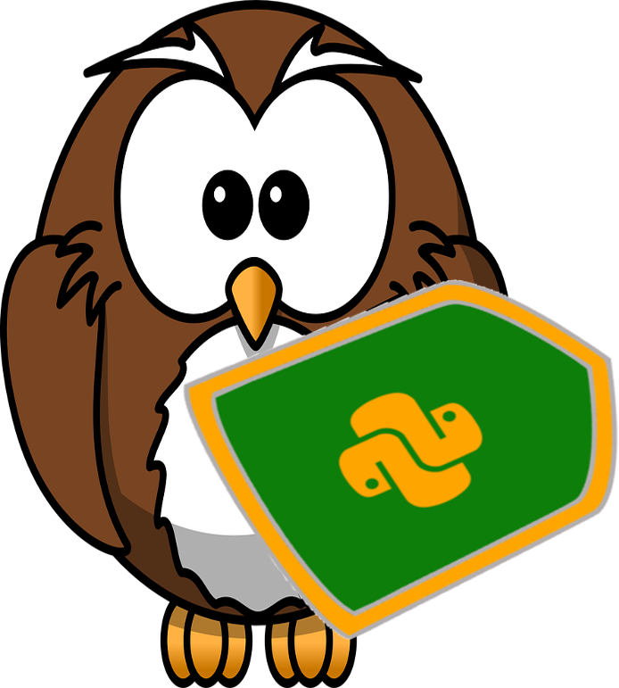

# PyQuest !
**Nagy's Question &amp; Answer Collection for Python**

PyQuest is a simple strategy to manage an ever growing set of questions & answers on the Python programming language. PyQuest's globally unique numbering strategy is designed to help other 'Pythoneers find YOUR clever solutions across the ['Pythoneering planet](https://link.springer.com/video/10.1007/978-1-4842-9454-3) as well.

PyQuest is also about sharing printable cards, videos, online training, our solutions, as well as an educational card game.

*Created beforehand yet shared on the 'Hub on July 9, 2020, PyQuest **was** originally part of my **[DatMan](https://github.com/Python3-Training/DatMan/blob/master/LICENSE)** Project.*

*Everything related to the question and answer database application is now here!*

## zGroup
Created in May of 2020, here is the ever growing [Facebook group](https://www.facebook.com/PythonVideo/).

## zVideos
If you are new to Python - and a self-teacher - then [The PyQuest Primer](https://www.udemy.com/course/python-1000-the-python-primer/?referralCode=A22C48BD99DBF167A3DE) will show you how to use Python's **help system** to jump-start your very own DIY lessons.

Created well before 2020 were the [Udemy Videos](https://www.udemy.com/user/randallnagy2/). The Official PyQuest Videos started with:
- [Python 9000: Review Concepts (K1 thru K10)](https://www.udemy.com/course/python-interview-questions/?referralCode=6B199764132B575C503C)
- [Python 9000: Review Concepts (K11 thru K22)](https://www.udemy.com/course/nagys-python-review-k11-k22/?referralCode=2280C848244C9714E1E2)

These videos take weeks to create - We could use your financial support.

## zBooks
Here are [the Amazon books](https://www.amazon.com/Randall-Nagy/e/B08ZJLH1VN/ref=aufs_dp_fta_dsk).

### PyQuest Books
Updated to 100 Q&A case studies the latest edition of **Python Interview Questions & Concepts** combines the content of **PyQuest Beginner**, **PyQuest Advanced**, 35 additional **PyQuest Intermediate** concepts as well as 5 more PyQuest Beginner questions, answers, and code demonstrations. The updated set of PyQuest cards are part of the companion PyQuest card deck, game, and flashcard book.

- [100 Python Questions](https://www.amazon.com/dp/B0BH97W78F)

# zFree PyQuest Cards
Looking for that free 'Pythoneer card deck?

Then here 'be (Tampa Bay "pirate speak") zCollection of [PyQuest](https://www.facebook.com/PythonVideo) game cards:

First, enjoy our basic 100 [PyQuest Core Cards](https://github.com/Python3-Training/PyQuest/tree/main/CardGame/QuestCore).

Next, be sure to enjoy our huge collection of [PyQuest Project Cards](https://github.com/Python3-Training/PyQuest/tree/main/CardGame/QuestProjects) as well!

You may have also watched a video or seen an indepentant concept demonstrated? If so, then [PyQuest Bonus Cards](https://github.com/Python3-Training/PyQuest/tree/main/CardGame/QuestBonus) might be what you're looking for ...

## zSupport?
If you want to support the effort, I seek no donations. Instead, simply feel free to purchase one of [my educational](https://www.udemy.com/user/randallnagy2/) or [printed](https://www.amazon.com/Randall-Nagy/e/B08ZJLH1VN?ref=sr_ntt_srch_lnk_1&qid=1660050704&sr=8-1) productions?

Happy 'Pythoneering!

-- [Randall](http://soft9000.com)

